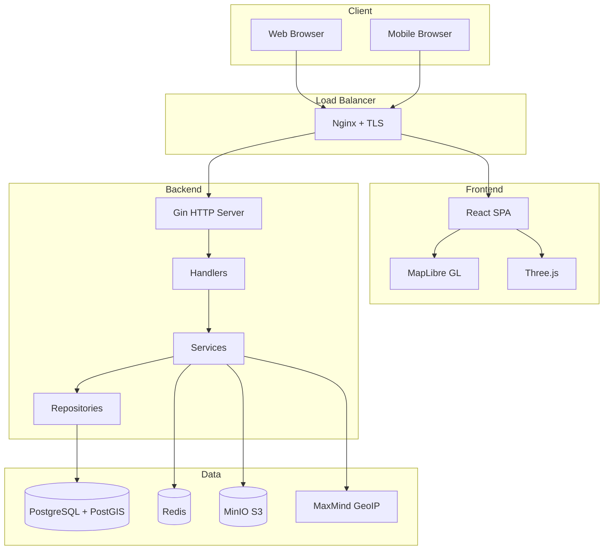

# Architecture

PropertyForSale follows a clean architecture pattern with clear separation of
concerns between layers.

## System Overview



## Backend Architecture

The backend follows the Clean Architecture pattern:

### Layers

1. **Handler Layer** (`internal/handler/`)
   - HTTP request/response handling
   - Input validation
   - Authentication/authorization

2. **Service Layer** (`internal/service/`)
   - Business logic
   - Orchestrates repositories
   - External service integration

3. **Repository Layer** (`internal/repository/`)
   - Data access abstraction
   - Database queries
   - Caching

4. **Domain Layer** (`internal/domain/`)
   - Pure business entities
   - No external dependencies
   - Value objects

### Data Flow

```
HTTP Request → Handler → Service → Repository → Database
                  ↓
              Validation
                  ↓
              Auth Check
```

## Frontend Architecture

### State Management

- **Server State**: TanStack Query for API data
- **Client State**: Zustand for UI state
- **Forms**: React Hook Form with Zod validation

### Key Components

- **MapLibre GL**: Interactive property maps
- **Three.js**: 3D floor plans and model viewing
- **Video.js**: 360-degree video playback
- **Chakra UI**: Responsive component library

## Database Schema

See the [Database documentation](database.md) for the complete schema.

## Deployment

The application is deployed using NixOS Anywhere on Hetzner Cloud:

- Nginx reverse proxy with Let's Encrypt SSL
- PostgreSQL with PostGIS
- Redis for caching and sessions
- MinIO for S3-compatible media storage

---

Made with :heart: by [Kartoza](https://kartoza.com)
